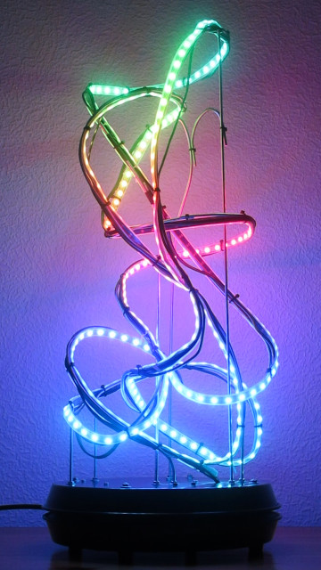

# led_rollercoaster

The code in this repository is for an led effect lamp in the style of a roller coaster. It consists of an intertwined led strip with 300 LEDs with a length of 5 meters. The software can calculate the height of every LED via an array of height values in track.c. That makes it possible to create height-aware effects.

## Hardware
    +--------------+                                 +---------------+
    |              | +5V                         Vcc |               |
    | Power supply |-----------+---------------------|               |
    |              | GND       |                 GND |    WS2812B    |
    |   5V / 18A   |-----------C------+--------------|               |
    |              |           |      |      DATA IN | 300 LEDs (5m) |
    +--------------+           |      |      +-------|               |
                               |      |      |       |               |
                           Vcc |  GND |  PD7 |       +---------------+
                           +---------------------+
                           |      AtMega2560     |
                           +---------------------+

The power supply and the controller are in the base. The whole structure has a height of 67cm and a diameter of 30cm.

## How to build the software

1. run "make" in the base dir of the repo (needs avr-gcc)
2. flash the resulting hex-file on the microcontroller (I use avrdude with an AVRISP mkII)

